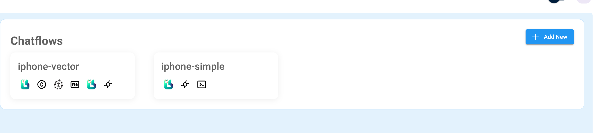

# Demo Code for the Civo Navigate Talk: How to "Skynet" your Kubernetes Clusters with LocalAI

## Prerequisites

- [Pulumi CLI](https://www.pulumi.com/docs/install/)
- [Node.js](https://nodejs.org/en/download/)
- [AWS Account](https://aws.amazon.com)
- [Pinecone Account](https://www.pinecone.io)

## How to deploy?

> If you run Pulumi for the first time, you will be asked to log in. Follow the instructions on the screen to
> login. You may need to create an account first, don't worry it is free.
> Or you handle the state of the different stacks yourself, and use `pulumi login --local`

### Step 1 - Clone the repository

```shell
git clone https://github.com/dirien/civo-navigate-austin.git
cd civo-navigate-austin
```

### Step 2 - Install the dependencies

```shell
pulumi install
```

### Step 3 - Login to AWS

```shell
aws configure
```

### Step 4 - Deploy the infrastructure

```shell
pulumi up
```

### Step 5 - Port forward the Flowise UI

As I did not deployed a LoadBalancer, you need to port forward the UI to your local machine:

```shell
kubectl port-forward svc/flowise-ui 3000:3000
```

### Step 6 - Add the demo workflows



Add the two demo workflows to your Flowise instance. You can find them in the `workflows` directory.

You may need to adjust the service URL for the local AI service and also the API Key for Pinecone.

### Now Celebrate, You're Done!

<p align="center">
  
</p>
